# EdgeVision System Architecture Documentation

The **EdgeVision PPE Compliance and Work-at-Height Platform** is built as an industrial-grade edge computer vision system utilizing Python FastAPI, Ultralytics YOLOv11, ByteTrack, MongoDB, and React (Vite / TanStack).

---

## 🏗️ End-to-End Pipeline Architecture

```mermaid
flowchart LR
    A[Camera Feed / RTSP / Video] --> B[Threaded Camera Frame Grabber]
    B --> C[Stage 1: Person Tracking - ByteTrack]
    C --> D[Stage 2: PPE Detection - YOLOv11]
    D --> E[Stage 3: Spatial Association]
    E --> F[Stage 4: Per-Zone Rule Engine]
    F --> G[Stage 5: Temporal Validation]
    G --> H[MongoDB & In-Memory Query Cache]
    H --> I[FastAPI REST & WebSockets]
    I --> J[React Executive Dashboard]
```

---

## ⚙️ Core Pipeline Components

1. **Threaded Camera (`ThreadedCamera`)**: Non-blocking frame reader with thread-safe lock protection (`cap_lock`) to handle HTTP progressive YouTube streams and RTSP feeds. Features auto-reconnect logic to prevent decoder crash or frozen sockets.
2. **Vision Pipeline (`VisionPipeline`)**: Asynchronous multi-stage frame processing pipeline running YOLOv11 detection, person tracking, and PPE association via bounding-box heuristics.
3. **Rule Engine (`RuleEngine`)**: Dynamic per-zone rule validator matching required safety equipment (`helmet`, `vest`, `boots`, `safety_belt`, `hook`) against tracked workers.
4. **Temporal Validator (`TemporalValidator`)**: Noise suppression engine enforcing 8/10 frame validation, minimum dwell time, and configurable confidence floors before raising alerts.
5. **MongoDB Persistence & Query Cache (`db.py` & `mongo_cache`)**: Fast database layer with tag-based invalidation for instant dashboard metric updates.
6. **Frontend Executive Dashboard (`React + TanStack Router`)**: Dark industrial panel UI providing real-time live monitoring, triage workflow, camera management, zone rule configuration, and telemetry reporting.
